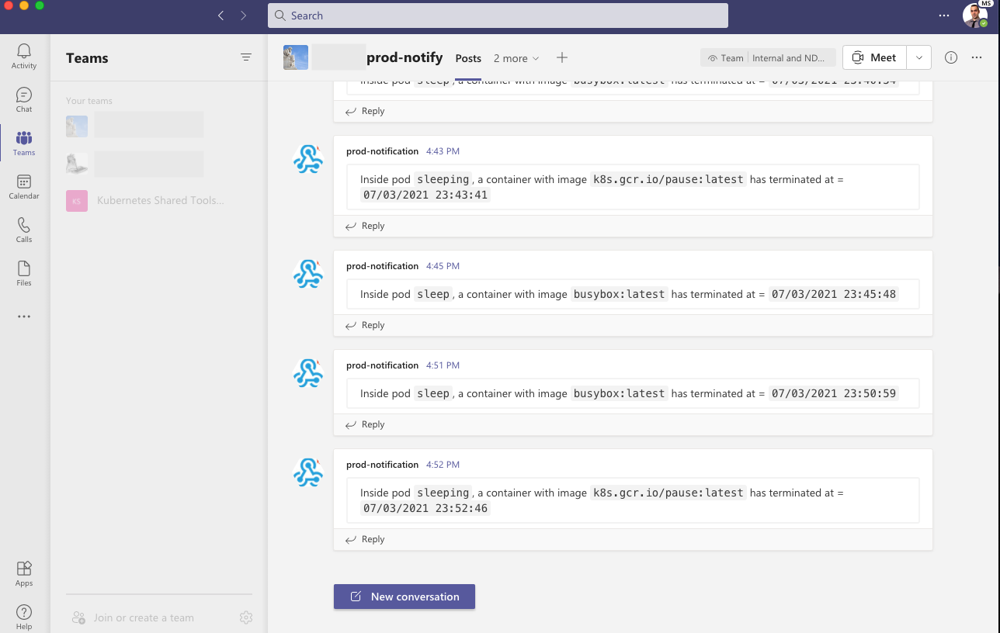

# Introduction 

This project listens to Kubernetes (K8s) pods, and when a pod's container is restarted, we notify a Microsoft Teams about this event. 


The namespace is of the pods to monitor is specified as an environment variable = `NAMESPACE`. 

You must specify an environment variable = `TEAMS_WEBHOOK` to a reacheable webhook.

Alerts will be posted with the appropriate text messge to the Teams webhook url.

Expected output on Teams:

 

# Using this service within a K8s cluster

all the instructions below assume you are in the top directory of the repo you cloned.

```
 tree -L 1
.
├── Dockerfile
├── Makefile
├── README.md
├── config
├── k8s-restart.csproj
├── k8s-restart.sln
└── src
```

## Build and push Docker image, and create the K8s pod

To run the code as a container (or K8s pod) and avoid deploying dotnet on your local machine, you can build the code using docker build.

The Makefile will run the docker commands.

Make sure you did docker login if you intend to push to your docker registry

```shell
make docker-build
make docker-push # optional
make deploy
```

## Make deploy under the hood

What the command `make deploy` will do under the hood in the following:

create the role and rolebinding that enables the pod to communicate with the K8s-API-Server

We can define the webhook in a K8s secret (recommended, and make sure not to upload the webhook in version control e.g. github)

```shell
kubectl apply -f ./config/role.yaml
kubectl apply -f ./config/role-binding.yaml
kubectl apply -f ./config/secret.yaml
```

Note: modify the data in the secret, to add a real webhook. Remember to do the  base64 encoding. E.g.

```
echo "somewebhookurl" | base64
```

Run as a pod in your cluster

`kubectl apply -f ./config/pod.yaml`

the pod content is shown below.

```yaml
apiVersion: v1
kind: Pod
metadata:
  name: restart-notifier
  namespace: default  # change to match the namespace of your choice, if empty, "default" is used
spec:
  containers:
  - name: restart-notifier
    image: restart-notifier:1.0
    imagePullPolicy: IfNotPresent # available options: Always, IfNotPresent, Always
    env:
    - name: NAMESPACE
      value: "default"  # change to match the namespace of your pods e.g. kube-system, if empty, "default" is used
    #- name: TEAMS_WEBHOOK # uncommnent if not using a webhook in a secret, and comment out the env with valueFrom below
    #  value: "somewebhook"  # uncommnent if not using a webhook in a secret and comment out the env with valueFrom below
    - name: TEAMS_WEBHOOK
      valueFrom:
        secretKeyRef:
          name: webhook-secret
          key: WEBHOOK
    resources:
      limits:
        cpu: "0.2"
        memory: "200Mi"
      requests:
        cpu: "0.1"
        memory: "100Mi"
  ```

  ## Seeing the logs of the pod

`kubectl logs restart-notifier -f`

  ```txt
Program started... will watch pods in namespace = default
Waiting for SIGINT/SIGTERM
Event Received From K8s
Event type = Added, occured on pod with name = restart-notifier
Event Received From K8s
Event type = Added, occured on pod with name = sleeping
Event Received From K8s
Event type = Added, occured on pod with name = sleep
Event Received From K8s
Event type = Modified, occured on pod with name = sleeping
Inside pod `sleeping`, a container with image `busybox:latest` has terminated at = `07/03/2021 23:43:41`
notifying teams...
teams request response: OK
Event Received From K8s
Event type = Modified, occured on pod with name = sleeping
```

# Getting started for developers 

make sure kubeconfig exists in `~/.kube/config`, or `KUBECONFIG` env var is set to the kube config path
make sure the microsoft teams webhook is specified as an environment variable = `DEPLOYMENTNAME` as well as the service name as `SERVICENAME`.

1.	Install dotnet
2.	dotnet restore
3.	dotnet run

## To clean up when you no longer need this functionality

```
To cleanup after, you can use:

```shell
make cleanup
```

## Manual testing

To test that the pod is deployed properly, you can create a pod that its container periodically exits (every 60 seconds):

```
kubectl run sleeping --image=busybox --command sleep 60
```


